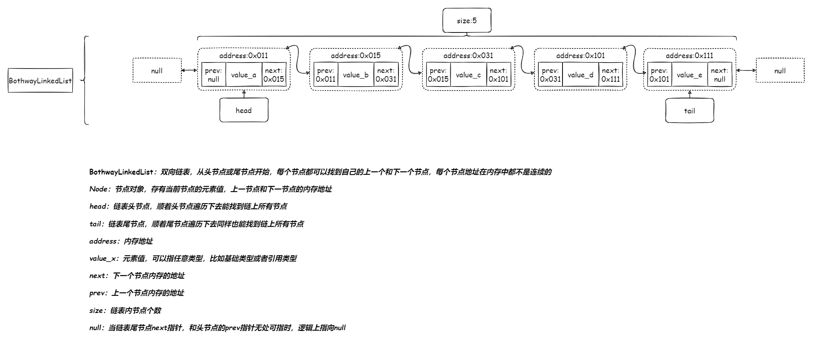

# 双向链表(BothwayLinkedList)

### 1.图示



### 2.过程

### 3.实现

```java
// 双向链表
public class BothwayLinkedList<T> {
    // 记录节点个数
    private int size = 0;
    // 存放头节点
    private Node<T> head;
    // 存放尾节点
    private Node<T> tail;
    // 创建Node类
    private class Node<T> {
        // 节点元素值
        T value;
        // 下一个节点内存地址
        Node<T> next;
        // 上一个节点内存地址
        Node<T> prev;
        // 构造方法
        public Node(T value,Node<T> next,Node<T> prev) {
            this.value = value;
            this.next = next;
            this.prev = prev;
        }
    }

    // 向指定位置添加节点
    public void add(int index,T value) {
        // 判断下标是否合法
        if (index < 0 | index > size) {
            throw new IndexOutOfBoundsException("下标不合法");
        }
        // 当链表内没有一个节点时
        if (head == null) {
            // 头节点直接等于新加入的节点
            head = new Node<T>(value,null,null);
            // 头尾节点相等
            tail = head;
            // 节点个数加一
            size++;
            // 直接返回程序
            return;
        }
        // 当index为0时,也就是添加到头节点前面
        if (index == 0) {
            // 头节点上一个节点地址被换为新新节点地址,并且新节点的上一个节点地址是原头节点上一个节点地址,下一个节点地址是原头节点
            head.prev = new Node<T>(value,head,head.prev);
            // 新的头节点来的了新添加的节点
            head = head.prev;
            // 节点个数加一
            size++;
            // 直接返回程序
            return;
        }
        // 当index为size时,也就是添加到尾节点后面
        if (index == size) {
            // 尾节点下一个节点地址被换为新新节点地址,并且新节点的上一个节点地址是原尾头节点地址,下一个节点地址是原头节点下一个节点地址
            tail.next = new Node<T>(value,tail.next,tail);
            // 新的尾节点来的了新添加的节点
            tail = tail.next;
            // 节点个数加一
            size++;
            // 直接返回程序
            return;
        }
        // 如果index在中间不在头也不再尾走下面这段程序
        // 找到对应位置的节点
        Node<T> indexNode = findOfIndex(index);
        // 新节点的上一个节点地址是当前指定节点的上一个节点,下一个节点地址是当前指定节点
        Node<T> newNode = new Node<T>(value,indexNode,indexNode.prev);
        // 当前指定节点上一个节点的下一个节点地址更改为新添加节点地址
        indexNode.prev.next = newNode;
        // 当前指定节点的上一个节点地址更改为新添加节点地址
        indexNode.prev = newNode;
        // 节点个数加一
        size++;
    }

    // 删除指定位置节点
    public T remove(int index) {
        // 对非法索引抛出异常并警告
        checkIndex(index);
        // 当index为0时,也就是移除当前头节点时
        if (index == 0) {
            // 记录将要移除节点的值
            T remove = head.value;
            // 新的头节点来到原头节点的下一个节点
            head = head.next;
            // 新头节点上一个节点地址更改为null
            head.prev = null;
            // 元素个数减一
            size--;
            // 直接返回被移除节点的值
            return remove;
        }
        // 当index为size时,也就是移除当前尾节点时
        if (index == size-1) {
            // 记录将要移除节点的值
            T remove = tail.value;
            // 新的尾节点来到原尾节点的上一个节点
            tail = tail.prev;
            // 新尾节点下一个节点地址更改为null
            tail.next = null;
            // 元素个数减一
            size--;
            // 直接返回被移除节点的值
            return remove;
        }
        // 如果index在中间不在头也不再尾走下面这段程序
        // 找到对应位置的节点
        Node<T> indexNode = findOfIndex(index);
        // 当前指定节点的下一个节点的上一个节点地址更改为当前指定节点的上一个节点地址
        indexNode.next.prev = indexNode.prev;
        // 当前指定节点的上一个节点的下一个节点地址更改为当前指定节点的下一个节点地址
        indexNode.prev.next = indexNode.next;
        // 节点个数减一
        size--;
        // 返回被移除节点的值
        return indexNode.value;
    }

    // 设置指定节点值
    public void set(int index,T value) {
        // 对非法索引抛出异常并警告
        checkIndex(index);
        // 找到对应位置节点并设置值
        findOfIndex(index).value = value;
    }

    // 获取指定节点值
    public T get(int index) {
        // 对非法索引抛出异常并警告
        checkIndex(index);
        // 找到对应位置节点并获取值
        return findOfIndex(index).value;
    }

    // 查找指定位置节点
    public Node<T> findOfIndex(int index) {
        if (index >= (size>>1)) {
            Node<T> node = tail;
            for (int i = size-1; i > index; i--) {
                node = node.prev;
            }
            return node;
        } else {
            Node<T> node = head;
            for (int i = 0; i < index; i++) {
                node = node.next;
            }
            return node;
        }
    }

    // 测试呈现
    public String toString() {
        String tmp = "";
        Node<T> node = head;
        for (int i = 0; i < size; i++) {
            tmp += "\t" + node.value + ";";
            node = node.next;
        }
        return "size:" + size + "|" + "head:" + head.value + "|" + "tail:" + tail.value + "|" + tmp;
    }

    // 对非法索引抛出异常并警告
    public void checkIndex(int index) {
        if (index < 0 | index >= size) {
            throw new IndexOutOfBoundsException("下标不合法");
        }
    }
}
```

