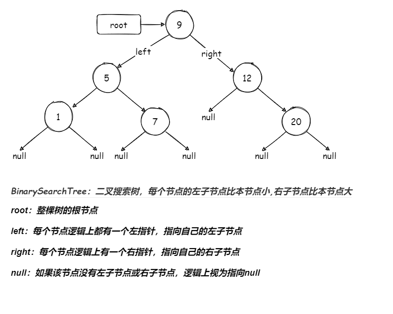

# 二叉搜索树(BinarySearchTree)

### 1.图示



### 2.过程

### 3.实现

##### List接口

```java
// 列表接口
public interface List<T> {
    // 指定位置添加元素
    public void add(int index,T value);
    // 删除指定元素
    public T remove(int index);
    // 设置指定元素值
    public void set(int index,T value);
    // 获取指定元素值
    public T get(int index);
    // 是否为空
    public boolean isEmpty();
    // 获取元素个数
    public int size();
}
```

##### DynamicArray实现List接口

```java
// 动态数组
// 实现列表接口
public class DynamicArray<T> implements List<T> {
    // 记录元素个数
    private int size = 0;
    // 默认初始化容量
    private static final int INIT_CAPACITY = 10;
    // 记录扩容量
    private int dilatations;
    // 当元素个数为空时需要返回的值
    private static final int IS_NULL = -1;
    // 用于存储元素
    private T[] array = (T[]) new Object[INIT_CAPACITY];
    // 无参构造
    public DynamicArray(){
        this(INIT_CAPACITY);
    }
    // 有参构造函数
    public DynamicArray(int capacity){
        this.array = (T[]) new Object[capacity > INIT_CAPACITY ? capacity : INIT_CAPACITY];
    }

    // 指定位置添加元素
    @Override
    public void add(int index, T value) {
        // 对输入下标判断是否合法,如果不合法提出警告
        if (index < 0 | index > size) {
            throw new IndexOutOfBoundsException("下标不合法");
        }
        // 判断数组是否已经存满,存满扩容
        if (size == array.length) {
            dilatation();
        }
        // 将index后所有元素从后往前一次向后移动一位
        for (int i = size; i > index; i--) {
            array[i] = array[i-1];
        }
        // index位置被赋予目标值
        array[index] = value;
        // 元素个数加一
        size++;
    }

    // 指定位置删除元素
    @Override
    public T remove(int index) {
        // 对输入下标判断是否合法,如果不合法提出警告
        checkIndex(index);
        T remove = array[index];
        // 将index后所有元素从前往后一次向前移动一位
        for (int i = index; i < size-1; i++) {
            array[i] = array[i+1];
        }
        size--;
        if (array.length-size > dilatations) {
            shrinkage();
        }
        return remove;
    }

    @Override
    public void set(int index, T value) {
        // 对输入下标判断是否合法,如果不合法提出警告
        checkIndex(index);
        // 直接这是值
        array[index] = value;
    }

    @Override
    public T get(int index) {
        // 对输入下标判断是否合法,如果不合法提出警告
        checkIndex(index);
        // 直接获取值
        return array[index];
    }

    @Override
    public boolean isEmpty() {
        return size == 0;
    }

    @Override
    public int size() {
        return size;
    }

    // 测试呈现
    @Override
    public String toString() {
        String eles = "";
        for (int i = 0; i < array.length;i++) {
            eles += "\t" + array[i] + ";";
        }
        return "size:"+ size + "|\tlength:" + array.length + "|\tdilatations:" + dilatations + "|\teles:" + eles;
    }
    // 数组扩容
    private void dilatation() {
        // 扩容量,原来的近1.5倍
        dilatations = array.length >> 1;
        // 创建长度为原来1.5倍的新数组
        T[] newArray = (T[]) new Object[array.length + dilatations];
        copyArray(newArray);
    }

    // 数组缩容
    private void shrinkage() {
        // 创建长度为原来2/3倍的新数组
        T[] newArray = (T[]) new Object[array.length - dilatations];
        // 将原来数组元素拷贝到新数组
        copyArray(newArray);
    }

    // 拷贝数组
    private void copyArray(T[] newArray) {
        // 将原来数组元素拷贝到新数组
        for (int i = 0; i < size; i++) {
            newArray[i] = array[i];
        }
        // 新数组充当容器
        array = newArray;
    }

    // 对输入下标判断是否合法,如果不合法提出警告
    private void checkIndex(int index) {
        if (index < 0 | index >= size) {
            throw new IndexOutOfBoundsException("下标不合法");
        }
    }
}
```

##### SingleLinkedList实现List接口

```java
// 单向链表
// 实现列表接口
public class SingleLinkedList<T> implements List<T> {
    // 记录节点个数
    private int size = 0;
    // 存放头节点
    private Node head;
    // 节点类
    private class Node {
        // 节点值
        T value;
        // 下一个节点地址
        Node next;
        // 构造方法
        public Node(T value,Node next) {
            this.value = value;
            this.next = next;
        }
    }

    // 插入元素到指定节点
    @Override
    public void add(int index, T value) {
        if (index < 0 | index > size ) {
            throw new IndexOutOfBoundsException("下标不合法");
        }
        if (index == 0) {
            head = new Node<T>(value,head);
            size++;
            return;
        }
        Node prev = findNodeOfIndex(index-1);
        prev.next = new Node(value,prev.next);
        size++;
    }

    // 删除指定节点
    @Override
    public T remove(int index) {
        checkIndex(index);
        if (index == 0) {
            head = head.next;
            size--;
            return head.value;
        }
        Node prev = findNodeOfIndex(index-1);
        T remove = prev.next.value;
        prev.next = prev.next.next;
        size--;
        return remove;
    }

    // 设置指定节点值
    @Override
    public void set(int index, T value) {
        checkIndex(index);
        findNodeOfIndex(index).value = value;
    }

    // 获取节点值
    @Override
    public T get(int index) {
        checkIndex(index);
        return findNodeOfIndex(index).value;
    }

    // 判断容器是否为控
    @Override
    public boolean isEmpty() {
        return size == 0;
    }

    // 获取节点个数
    @Override
    public int size() {
        return size;
    }

    // 查找指定节点
    private Node findNodeOfIndex(int index) {
        Node node = head;
        for (int i = 0; i < index; i++) {
            node = node.next;
        }
        return node;
    }

    // 判断下标是否合法
    private void checkIndex(int index) {
        if (index < 0 | index >= size ) {
            throw new IndexOutOfBoundsException("下标不合法");
        }

    }

    // 测试呈现
    public String toString() {
        String tmp = "";
        Node node = head;
        for (int i = 0; i < size; i++) {
            tmp += "\t" + node.value + ";";
            node = node.next;
        }
        return tmp;
    }
}
```

##### Queue接口

```java
// 队列接口
public interface Queue<T> {
    // 向队列中插入元素
    public void enqueue(T t);
    // 从队列中拿出元素
    public T dequeue();
    // 返回队列内元素个数
    public int size();
    // 查看队列是否为空
    public boolean isEmpty();
}
```

##### QueueArray实现Queue接口

```java
// 动态数队列
// 实现队列接口
public class QueueArray<T> implements Queue<T> {
    List<T> list = new DynamicArray<T>();

    @Override
    public void enqueue(T t) {
        list.add(list.size(),t);
    }

    @Override
    public T dequeue() {
        return list.remove(0);
    }

    @Override
    public int size() {
        return list.size();
    }

    @Override
    public boolean isEmpty() {
        return list.isEmpty();
    }

    // 测试呈现
    @Override
    public String toString() {
        return list.toString();
    }

}
```

##### QueueLink实现Queue接口

```java
// 单向链队列
// 实现队列接口
public class QueueLink<T> implements Queue<T> {
    List<T> list = new SingleLinkedList<T>();

    @Override
    public void enqueue(T t) {
        list.add(list.size(),t);
    }

    @Override
    public T dequeue() {
        return list.remove(0);
    }

    @Override
    public int size() {
        return list.size();
    }

    @Override
    public boolean isEmpty() {
        return list.isEmpty();
    }

    // 测试呈现
    @Override
    public String toString() {
        return list.toString();
    }
}
```

##### BinarySearchTree类

```java
// 二叉搜索树
public class BinarySearchTree<K extends Comparable<K>,V> {
    // 记录节点个数
    private int size = 0;
    // 记录跟节点
    private Node root;
    // 节点类
    private class Node {
        // 键
        K key;
        // 值
        V val;
        // 左子节点
        Node left;
        // 右子节点
        Node right;
        // 节点内部类
        public Node(K key,V val,Node left,Node right) {
            this.key = key;
            this.val = val;
            this.left = left;
            this.right = right;
        }
    }

    // 构造方法
    public BinarySearchTree(K key,V val) {
        this.root = new Node(key,val,null,null);
        size++;
    }

    // 在整棵树中添加节点
    public void put(K key,V val) {
        root = put(root,key,val);
    }

    // 在指定树中添加节点,如果键一样直接改为新值
    public Node put(Node node,K key,V val) {
        // 当指定节点为空时,直接将新节点添加
        if(node == null) {
            // 节点个数加一
            size++;
            return new Node(key,val,null,null);
        }
        // 比较要添加的键和指定节点的键
        int com = key.compareTo(node.key);
        // 将要添加的键更大
        if (com > 0) {
            /*
            更大的键要添加指定节点的右树,递归条用添加方法
            由于是递归调用,所有指定当前递归序指定的节点的右子节点传入
            这样递归到一个节点为空时,就会在最开始判断节点是否为空时返回,返回值会返回上一层函数
            所以这里要将返回值赋值给新添加的节点的父节点,也就是函数返回时的上一层函数的指定节点的右子节点
            */
            node.right = put(node.right,key,val);
        } else if (com < 0) { // 指定节点的键更大
            /*
            较小的键要添加指定节点的左树中,递归条用添加方法
            由于是递归调用,所有指定当前递归序指定的节点的左子节点传入
            这样递归到一个节点为空时,就会在最开始判断节点是否为空时返回,返回值会返回上一层函数
            所以这里要将返回值赋值给新添加的节点的父节点,也就是函数返回时的上一层函数的指定节点的左子节点
            */
             node.left = put(node.left,key,val);
        } else { // 剩下的情况就只有指定键与要添加的键相等
            // 当键相等时,直接更改值内容
            node.val = val;
        }
        // 返回插入的节点
        return  node;
    }

    // 在整棵树中根据键删除节点
    public void del(K key) {
        root = del(root,key);
    }

    // 在指定树中根据键删除节点
    public Node del(Node node,K key) {
        // 找不到节点时,返回null
        if (node == null) {
            return null;
        }
        int com = key.compareTo(node.key);
        if (com > 0) {
            node.right =  del(node.right,key);
        } else if (com < 0) {
            node.left = del(node.left,key);
        } else {
            size--;
            // 当指定节点的左子树为空时,那么删除该节点时就直接将该节点的右子树接到该节点的父节点即可
            if (node.left == null) {
                return node.right;
            }
            // 当指定节点的右子树为空时,那么删除该节点时就直接将该节点的右子树接到该节点的父节点即可
            if (node.right == null) {
                return node.left;
            }
            // 获取将被删除节点右子树中最小节点
            Node minNode = minKey(node.right);
            // 如果最小节点就是将被删除节点的右子节点,这种情况不需要考虑最小节点的右子树
            if (minNode == node.right) {
                // 只需要将最小节点的左指针指向将被删除节点的左子树
                minNode.left = node.left;
                // 返回最小节点,相当于返回值返回给上一层递归,也就是被删删除节点的原父节点
                return minNode;
            }
            // 获取将被删除节点右子树中最小节点的父节点
            Node minNodePat = minPatK(node.right);
            // 这里要考虑最小节点存不存在右子树,如果存在,需要将最小节点的父节点的左指针指向做小节点的右子树,不存在直接设置为空
            minNodePat.left = minNode.right != null ? minNode.right : null;

            // 最小节点的左指针指向被删除节点的左子树
            minNode.left = node.left;
            // 最小节点的右指针指向被删除节点的右子树
            minNode.right = node.right;
            // 返回最小节点,相当于返回值返回给上一层递归,也就是被删删除节点的原父节点
            return minNode;
        }
        // 这句其实没有什么实际意义,为了不报错
        return node;
    }

    // 获取节点个数
    public int size() {
        return size;
    }

    // 在整棵树中根据键获取节点
    public V get(K key) {
        return get(root,key);
    }

    // 在指定树中根据键获取节点
    public V get(Node node,K key) {
        // 找不到节点返回null
        if (node == null) {
            return null;
        }
        int com = key.compareTo(node.key);
        if (com > 0) {
            return get(node.right,key);
        } else if (com < 0) {
            return get(node.left,key);
        } else {
            return node.val;
        }
    }

    // 获取整棵树最小键节点
    public Node minKey() {
        return minKey(root);
    }

    // 指定树最小键节点
    private Node minKey(Node node) {
        return node.left == null ? node : minKey(node.left);
    }

    // 获取整棵树最大键节点
    public Node maxKey() {
        return maxKey(root);
    }

    public V getV(Node node) {
        return node.val;
    }

    public K getK(Node node) {
        return node.key;
    }

    // 指定树最大键节点
    public Node maxKey(Node node) {
        return node.right == null ? node : maxKey(node.right);
    }

    // 找以node为跟节点的树中最小键的节点的父节点
    private Node minPatK(Node node) {
        if (node == null || node.left == null){
            return null;
        }
        return node.left.left == null ? node : node.left;
    }

    // 整棵树前序遍历
    public Queue<K> preErgodic() {
        Queue<K> queue = new QueueArray<K>();
        return preErgodic(root,queue);
    }

    // 指定树前序遍历
    public Queue<K> preErgodic(Node node,Queue<K> queue) {
        if (node == null) {
            return null;
        }
        /*
        将键放入队列
        纵观整个递归过程,这里将键放入队列操作可以看作一次对节点的访问
        那么此时该位置的访问时机就是第一次来到节点的时机
        */
        queue.enqueue(node.key);

        // 如果左树不空,那么继续递归调用函数 (指定节点为当前节点的左子树) 直到指定节点的左子树为空时返回上一层
        // 此时该位置的访问时机就是第二次来到节点的时机
        if(node.left != null) {

            // 继续以深度优先遍历的方式遍历
            preErgodic(node.left,queue);
        }


        // 如果右树不空,那么继续递归调用函数 (指定节点为当前节点的右子树) 直到指定节点的右子树为空时返回上一层
        // 此时该位置的访问时机就是第三次来到节点的时机
        if (node.right != null) {
            // 继续以深度优先遍历的方式遍历
            preErgodic(node.right,queue);
        }

        return queue;
    }

    // 中序遍历
    public Queue<K> midErgodic() {
        Queue<K> queue = new QueueArray<>();
        return midErgodic(root,queue);
    }

    // 指定树中序遍历
    public Queue<K> midErgodic(Node node,Queue<K> queue) {
        if (node == null) {
            return null;
        }

        // 如果左树不空,那么继续递归调用函数 (指定节点为当前节点的左子树) 直到指定节点的左子树为空时返回上一层
        // 此时该位置的访问时机就是第一次来到节点的时机
        if(node.left != null) {
            // 继续以深度优先遍历的方式遍历
            midErgodic(node.left,queue);
        }

        /*
        将键放入队列
        纵观整个递归过程,这里将键放入队列操作可以看作一次对节点的访问
        那么此时该位置的访问时机就是第二次来到节点的时机
        */
        queue.enqueue(node.key);

        // 如果右树不空,那么继续递归调用函数 (指定节点为当前节点的右子树) 直到指定节点的右子树为空时返回上一层
        // 此时该位置的访问时机就是第三次来到节点的时机
        if (node.right != null) {
            // 继续以深度优先遍历的方式遍历
            midErgodic(node.right,queue);
        }

        return queue;
    }


    // 后序遍历
    public Queue<K> afterErgodic() {
        Queue<K> queue = new QueueArray<>();
        return afterErgodic(root,queue);
    }

    // 指定树后序遍历
    public Queue<K> afterErgodic(Node node,Queue<K> queue) {
        if (node == null) {
            return null;
        }

        // 如果左树不空,那么继续递归调用函数 (指定节点为当前节点的左子树) 直到指定节点的左子树为空时返回上一层
        // 此时该位置的访问时机就是第一次来到节点的时机
        if(node.left != null) {
            // 继续以深度优先遍历的方式遍历
            afterErgodic(node.left,queue);
        }

        // 如果右树不空,那么继续递归调用函数 (指定节点为当前节点的右子树) 直到指定节点的右子树为空时返回上一层
        // 此时该位置的访问时机就是第二次来到节点的时机
        if (node.right != null) {
            // 继续以深度优先遍历的方式遍历
            afterErgodic(node.right,queue);
        }

        /*
        将键放入队列
        纵观整个递归过程,这里将键放入队列操作可以看作一次对节点的访问
        那么此时该位置的访问时机就是第三次来到节点的时机
        */
        queue.enqueue(node.key);

        return queue;
    }

    // 整棵树层序遍历
    public Queue<K> hierarchyErgodic() {
        return hierarchyErgodic(root,new QueueArray<>(),new QueueArray<>());
    }

    // 指定树层序遍历
    // queue内放节点
    // help辅助队列依次放节点的键
    private Queue<K> hierarchyErgodic(Node node,Queue<Node> queue,Queue<K> help) {
        // 首先默认指定树的根节点先放入队列
        queue.enqueue(node);
        // 遍历并取出队列内的元素,如果队列为空停止遍历,返回辅助队列
        while (!queue.isEmpty()) {
            // 弹出一个队列元素,自然就是刚放进去的元素,按找队列的先进先出原则弹出
            Node theNode = queue.dequeue();
            // 将弹出的元素的键放入辅助队列
            help.enqueue(theNode.key);
            // 判断当前操作的元素的左指针是否存在
            if (theNode.left != null) {
                // 存在,放入队列中
                queue.enqueue(theNode.left);
            }
            // 判断当前操作的元素的右指针是否存在
            if (theNode.right != null) {
                // 存在,放入队列中
                queue.enqueue(theNode.right);
            }
        }
        // 遍历完成,返回辅助数组
        return help;
    }
    
    // 获取整个树的最大深度
    public int maxDeep() {
        return maxDeep(root);
    }

    // 获取指定树的最大深度
    private int maxDeep(Node node) {
        // 如果指定树不存在,直接返回空
        if (node == null) {
            return 0;
        }
        // 取左右树最大深度当中的较大值并且加一,加一的含义就是加上根节点本层深度
        return Math.max(maxDeep(node.left),maxDeep(node.right)) + 1;
    }

}
```

