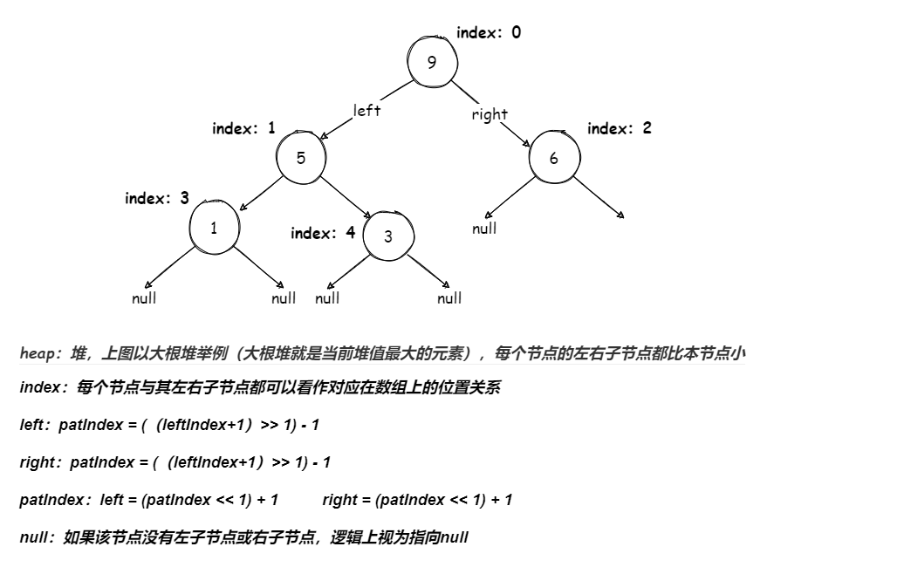

# 堆(Heap)（最大优先队列）

### 1.图示



### 2.过程

### 3.实现

##### BigRootHeap类

```java
// 大根堆(最大优先队列)
public class BigRootHeap<V extends Comparable<V>>{
    // 记录元素个数
    private int size;
    // 用于存放元素
    private V[] values;
    // 构造函数
    public BigRootHeap(int cap) {
        this.values = (V[]) new Comparable[cap];
    }

    // 判断索引i是否小于索引j
    public boolean less(int i,int j) {
        return values[i].compareTo(values[j]) < 0;
    }

    // 两个索引位置交换值
    private void swap(int i,int j) {
        V tmp = values[i];
        values[i] = values[j];
        values[j] = tmp;
    }

    // 插入元素
    public void insert(V v) {
        values[size++] = v;
        heapInsert(size-1);
    }

    // 拿出最大元素
    public V pop() {
        return del(0);
    }

    // 删除指定位置元素
    private V del(int i) {
        V r = values[i];
        values[i] = values[--size];
        values[size] = null;
        heapify(i);
        return r;
    }

    // 上浮
    private void heapInsert(int i) {
        // 当上浮到堆顶时就返回
        if (i == 0) {
            return;
        }
        // 获取目标上浮元素的父元素索引
        int patIndex = (i+1>>1)-1;
        // 如果父元素值比目标元素值小
        if(less(patIndex,i)) {
            // 则交换两个节点元素
            swap(patIndex,i);
        }
        // 继续上浮
        heapInsert(patIndex);
    }

    // 下沉
    private void heapify(int i) {
        int left = (i<<1)+1;
        int right = left+1;
        // base case
        // 左子节点不存在长度范围内,说明左子树不存在了
        if (left >= size) {
            return;
        }
        // 获取较大子节点
        int big = values[right] == null ? left : (less(left,right) ? right : left);
        // 将目标节点与子节点交换
        if (less(i,big)) {
            swap(i,big);
        }
        heapify(big);
    }

    public boolean isEmpty() {
        return size == 0;
    }

    public String toString() {
        String tmp = "";
        for (int i = 0; i < 15; i++) {
            tmp += "\t" + values[i];
        }
        return "size:" + size + "|" + "heap:" + tmp;
    }
}
```

