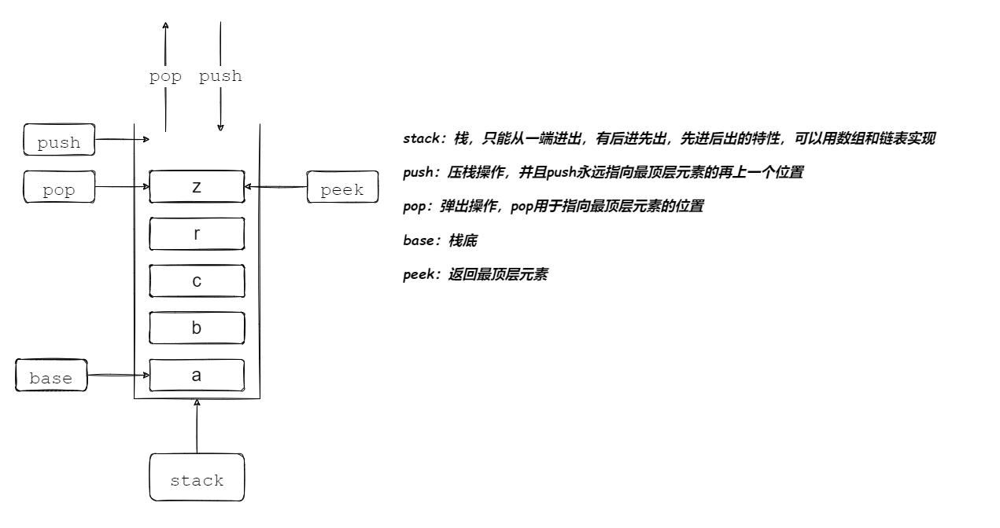

# 栈(stack)

### 1.图示



### 2.过程

### 3.实现

##### List接口

```java
// 列表接口
public interface List<T> {
    // 指定位置添加元素
    public void add(int index,T value);
    // 删除指定元素
    public T remove(int index);
    // 设置指定元素值
    public void set(int index,T value);
    // 获取指定元素值
    public T get(int index);
    // 是否为空
    public boolean isEmpty();
    // 获取元素个数
    public int size();
}
```

##### DynamicArray实现List接口

```java
// 动态数组
// 实现列表接口
public class DynamicArray<T> implements List<T> {
    // 记录元素个数
    private int size = 0;
    // 默认初始化容量
    private static final int INIT_CAPACITY = 10;
    // 记录扩容量
    private int dilatations;
    // 当元素个数为空时需要返回的值
    private static final int IS_NULL = -1;
    // 用于存储元素
    private T[] array = (T[]) new Object[INIT_CAPACITY];
    // 无参构造
    public DynamicArray(){
        this(INIT_CAPACITY);
    }
    // 有参构造函数
    public DynamicArray(int capacity){
        this.array = (T[]) new Object[capacity > INIT_CAPACITY ? capacity : INIT_CAPACITY];
    }

    // 指定位置添加元素
    @Override
    public void add(int index, T value) {
        // 对输入下标判断是否合法,如果不合法提出警告
        if (index < 0 | index > size) {
            throw new IndexOutOfBoundsException("下标不合法");
        }
        // 判断数组是否已经存满,存满扩容
        if (size == array.length) {
            dilatation();
        }
        // 将index后所有元素从后往前一次向后移动一位
        for (int i = size; i > index; i--) {
            array[i] = array[i-1];
        }
        // index位置被赋予目标值
        array[index] = value;
        // 元素个数加一
        size++;
    }

    // 指定位置删除元素
    @Override
    public T remove(int index) {
        // 对输入下标判断是否合法,如果不合法提出警告
        checkIndex(index);
        T remove = array[index];
        // 将index后所有元素从前往后一次向前移动一位
        for (int i = index; i < size-1; i++) {
            array[i] = array[i+1];
        }
        // 记录被删除的元素值
        // index位置被赋予目标值
        array[--size] = null;
        if (array.length-size > dilatations) {
            shrinkage();
        }
        return remove;
    }

    @Override
    public void set(int index, T value) {
        // 对输入下标判断是否合法,如果不合法提出警告
        checkIndex(index);
        // 直接这是值
        array[index] = value;
    }

    @Override
    public T get(int index) {
        // 对输入下标判断是否合法,如果不合法提出警告
        checkIndex(index);
        // 直接获取值
        return array[index];
    }

    @Override
    public boolean isEmpty() {
        return size == 0;
    }

    @Override
    public int size() {
        return size;
    }

    // 测试呈现
    @Override
    public String toString() {
        String eles = "";
        for (int i = 0; i < array.length;i++) {
            eles += "\t" + array[i] + ";";
        }
        return "size:"+ size + "|\tlength:" + array.length + "|\tdilatations:" + dilatations + "|\teles:" + eles;
    }
    // 数组扩容
    private void dilatation() {
        // 扩容量,原来的近1.5倍
        dilatations = array.length >> 1;
        // 创建长度为原来1.5倍的新数组
        T[] newArray = (T[]) new Object[array.length + dilatations];
        copyArray(newArray);
    }

    // 数组缩容
    private void shrinkage() {
        // 创建长度为原来2/3倍的新数组
        T[] newArray = (T[]) new Object[array.length - dilatations];
        // 将原来数组元素拷贝到新数组
        copyArray(newArray);
    }

    // 拷贝数组
    private void copyArray(T[] newArray) {
        // 将原来数组元素拷贝到新数组
        for (int i = 0; i < size; i++) {
            newArray[i] = array[i];
        }
        // 新数组充当容器
        array = newArray;
    }

    // 对输入下标判断是否合法,如果不合法提出警告
    private void checkIndex(int index) {
        if (index < 0 | index >= size) {
            throw new IndexOutOfBoundsException("下标不合法");
        }
    }
}
```

##### SingleLinkedList实现List接口

```java
// 单向链表
// 实现列表接口
public class SingleLinkedList<T> implements List<T> {
    // 记录节点个数
    private int size = 0;
    // 存放头节点
    private Node head;
    // 节点类
    private class Node {
        // 节点值
        T value;
        // 下一个节点地址
        Node next;
        // 构造方法
        public Node(T value,Node next) {
            this.value = value;
            this.next = next;
        }
    }

    // 插入元素到指定节点
    @Override
    public void add(int index, T value) {
        if (index < 0 | index > size ) {
            throw new IndexOutOfBoundsException("下标不合法");
        }
        if (index == 0) {
            head = new Node<T>(value,head);
            size++;
            return;
        }
        Node prev = findNodeOfIndex(index-1);
        prev.next = new Node(value,prev.next);
        size++;
    }

    // 删除指定节点
    @Override
    public T remove(int index) {
        checkIndex(index);
        if (index == 0) {
            head = head.next;
            size--;
            return head.value;
        }
        Node prev = findNodeOfIndex(index-1);
        T remove = prev.next.value;
        prev.next = prev.next.next;
        size--;
        return remove;
    }

    // 设置指定节点值
    @Override
    public void set(int index, T value) {
        checkIndex(index);
        findNodeOfIndex(index).value = value;
    }

    // 获取节点值
    @Override
    public T get(int index) {
        checkIndex(index);
        return findNodeOfIndex(index).value;
    }

    // 判断容器是否为控
    @Override
    public boolean isEmpty() {
        return size == 0;
    }

    // 获取节点个数
    @Override
    public int size() {
        return size;
    }

    // 查找指定节点
    private Node findNodeOfIndex(int index) {
        Node node = head;
        for (int i = 0; i < index; i++) {
            node = node.next;
        }
        return node;
    }

    // 判断下标是否合法
    private void checkIndex(int index) {
        if (index < 0 | index >= size ) {
            throw new IndexOutOfBoundsException("下标不合法");
        }

    }

    // 测试呈现
    public String toString() {
        String tmp = "";
        Node node = head;
        for (int i = 0; i < size; i++) {
            tmp += "\t" + node.value + ";";
            node = node.next;
        }
        return tmp;
    }
}
```

##### Stack接口

```java
// 栈接口
public interface Stack<T> {
    // 压栈
    public void push(T value);

    // 出栈
    public T pop();

    // 返回栈顶元素
    public T peek();

    // 测试呈现
    public String toString();
}
```

##### StackArray实现Stack接口

```java
// 动态数栈
// 实现栈接口
public class StackArray<T> implements Stack<T> {
    // 创建动态数组关联关系
    List<T> list = new DynamicArray<T>();

    // 压栈
    @Override
    public void push(T value) {
        list.add(list.size(),value);
    }

    // 出栈
    @Override
    public T pop() {
        return list.remove(list.size()-1);
    }

    // 返回栈顶元素
    @Override
    public T peek() {
        return list.get(list.size()-1);
    }

    // 测试呈现
    @Override
    public String toString() {
        return list.toString();
    }
}
```

##### StackLink实现Stack接口

```java
// 单向链栈
// 实现栈接口
public class StackLink<T> implements Stack<T> {
    // 创建单向链表关联关系
    List<T> list = new SingleLinkedList<T>();

    // 压栈
    @Override
    public void push(T value) {
        list.add(list.size(),value);
    }

    // 出栈
    @Override
    public T pop() {
        return list.remove(list.size()-1);
    }

    // 返回栈顶元素
    @Override
    public T peek() {
        return list.get(list.size()-1);
    }

    // 测试呈现
    @Override
    public String toString() {
        return list.toString();
    }
}
```

