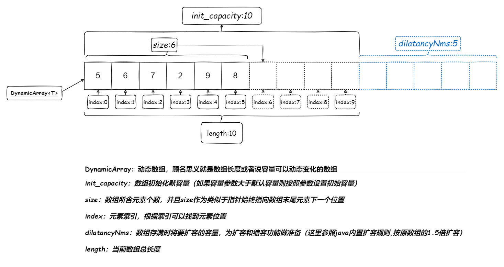

# 动态数组(DynamicArray)

### 1.图示



### 2.过程

### 3.实现

```java
// 动态数组
public class DynamicArray<T> {
    // 当前所含元素个数
    private int size = 0;
    // 初始化数组容量
    private static final int init_capacity = 10;
    // 用于存储元素
    private T[] arrays = (T[]) new Object[init_capacity];
    // 记录扩容量
    private int dilatancyNms = 0;

    // 无参构造
    public DynamicArray() {
        this(init_capacity);
    }

    // 传入数组容量
    public DynamicArray(int capacity) {
        // 判断出入容量是否大于默认容量,如果大于则将容量设置为传入容量,小于则使用默认容量
        this.arrays = (T[]) new Object[capacity > init_capacity ? capacity : init_capacity];
    }

    // 在末尾添加元素
    public void add(T ele) {
        // 判断数组是否已经存满是否需要扩容
        if (size > arrays.length-1) {
            dilatancy();
        }
        // 在尾部添加元素,并且元素个数加一
        arrays[size++] = ele;
    }

    // 指定位置添加元素
    public void add(int index, T ele) {
        // 判断指定位置是否合法在数组区间内
        if(index < 0 | index > size){
            return;
        }
        // 判断数组是否已经存满是否需要扩容
        if (size > arrays.length-1) {
            dilatancy();
        }
        // index后面所有元素整体向后移动一位
        for (int i = size; i > index; i--) {
            arrays[i] = arrays[i-1];
        }
        // 将需要添加的元素赋值给指定位置
        arrays[index] = ele;
        // 元素个数加一
        size++;
    }

    // 删除指定位置元素
    public T remove(int index) {
        // 判断指定位置是否合法在数组区间内
        if (index < 0 | index > size){
            return;
        }
        // 记录被删除的元素
        T remove = arrays[index];
        // index后面所有元素整体向前移动一位
        for (int i = index; i < size-1; i++) {
            arrays[i] = arrays[i+1];
        }
        // 删除末尾元素,元并且素个数减一
        arrays[--size] = null;
        // 判断数组是否需要缩容
        if (arrays.length-size >= dilatancyNms) {
            undilatancy();
        }
        return remove;
    }

    // 数组扩容
    public void dilatancy() {
        dilatancyNms = arrays.length >> 1;
        // 创建一个新数,容量是原来的1.5倍左右
        T[] newArrays = (T[]) new Object[arrays.length + dilatancyNms];
        // 将原数组中的元素都复制给新数组
        for (int i = 0; i < size; i++) {
            newArrays[i] = arrays[i];
        }
        // 将新数组赋值给原数组变量
        arrays = newArrays;
    }

    // 数组缩容
    public void undilatancy() {
        // 创建一个新数,容量是原来的1.5倍左右
        T[] newArrays = (T[]) new Object[arrays.length - dilatancyNms];
        // 将原数组中的元素都复制给新数组
        for (int i = 0; i < size; i++) {
            newArrays[i] = arrays[i];
        }
        // 将新数组赋值给原数组变量
        arrays = newArrays;
    }
	
    // 将对象属性转换成字符串形式呈现
    public String toString() {
        String eles = "";
        for (int i = 0; i < arrays.length;i++) {
            eles += "\t" + arrays[i] + ";";
        }
        return "size:"+ size + ";\nlength:" + arrays.length + ";\ndilatancyNms:" + dilatancyNms + ";\neles:" + eles;
    }

}
```

