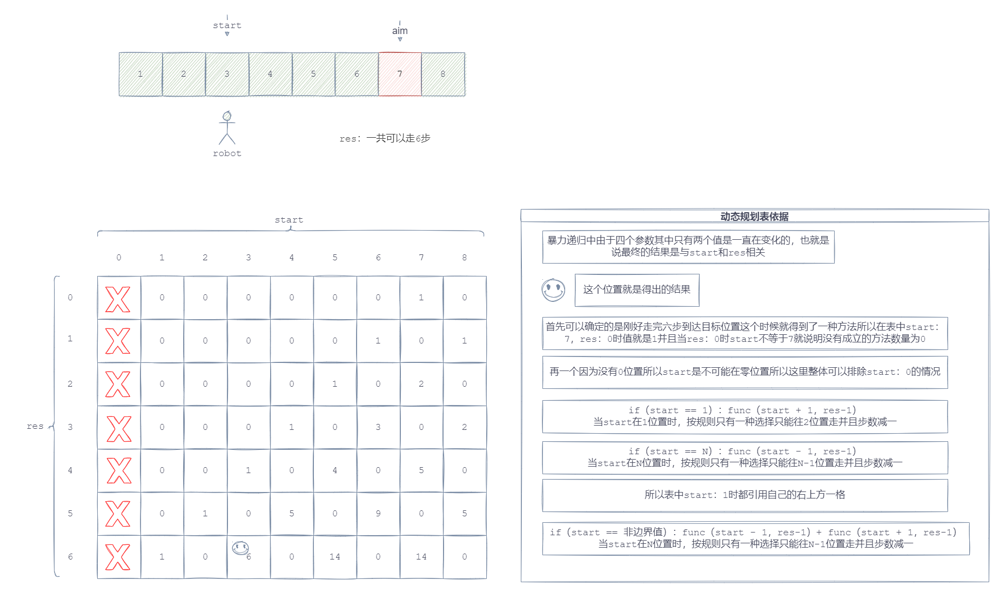

# 机器人移动方法数

### 1.题目

##### 假设有排成一行的N个位置,

##### 记为1-N, N一定大于或等于2开始时机器人在其中的M位置上(M一定是1~N中的一个)如果机器人来到1位置,

##### 那么下一步只能往右来到2位置;如果机器人来到N位置,

##### 那么下一步只能往左来到N-1位置;如果机器人来到中间位置,那么下一步可以往左走或者往右走;规定机器人必须走K步,

##### 最终能来到P位置(P也是1-N中的一个)的方法有多少种给定四个参数N、M、K、P,返回方法数。


### 2.图示




### 3.过程

### 4.题解

```java
// 机器人移动方法数 暴力递归->动态规划
public class RobotMove {

    /**
     * 尝试暴力递归入口方法
     * @param start 机器人起始位置
     * @param res 还剩余步数
     * @param aim 目标位置
     * @param N 总共有这么多个位置
     * @return 机器人移动方法数
     */
    public int violenceWays(int start, int res, int aim, int N) {
        return violenceWay(start,res,aim,N);
    }

    /**
     * 尝试暴力递归核心方法
     * @param start 机器人起始位置
     * @param res 还剩余步数
     * @param aim 目标位置
     * @param N 总共有这么多个位置
     * @return 机器人移动方法数
     */
    private int violenceWay(int start, int res, int aim, int N) {
        // 剩余步数为0时
        if (res == 0) {
            // 并且机器人位置已经来到目标位置,算找到一种方法,否则没找到
            return start == aim ? 1 : 0;
        }
        // 机器人来到边界1位置时
        if (start == 1) {
            // 只能选择先2位置走继续递归找有多少种方法
            return violenceWay(start+1,res-1,aim,N);
        }
        // 机器人来到边界N位置时
        if (start == N) {
            // 只能选择先N-1位置走继续递归找有多少种方法
            return violenceWay(start-1,res-1,aim,N);
        }
        // 非边界位置,就找向左走有多少种方法加上向右走有多少种方法之和
        return violenceWay(start+1,res-1,aim,N) + violenceWay(start-1,res-1,aim,N);
    }

    /**
     * 初浅动态规划入口方法
     * @param start 机器人起始位置
     * @param res 还剩余步数
     * @param aim 目标位置
     * @param N 总共有这么多个位置
     * @return 机器人移动方法数
     */
    public int tryDynamicWays(int start, int res, int aim, int N) {
        //多一个傻缓存
        int[][] ways = new int[N+1][res+1];
        for (int i = 0; i <= N; i++) {
            for (int j = 0; j <= res; j++) {
                // 初始化都为-1表示没有计算过这种方案
                ways[i][j] = -1;
            }
        }
        return tryDynamicWay(start,res,aim,N,ways);
    }

    /**
     * 初浅动态规划核心方法
     * @param start 机器人起始位置
     * @param res 还剩余步数
     * @param aim 目标位置
     * @param N 总共有这么多个位置
     * @param ways 傻缓存
     * @return 机器人移动方法数
     */
    private int tryDynamicWay(int start, int res, int aim, int N,int[][] ways) {
        if (ways[start][res] != -1) {
            // 如果不为-1表示曾经计算过,不需要在深入计算直接拿结果
            return ways[start][res];
        }
        if (res == 0) {
            return start == aim ? 1 : 0;
        } else if (start == 1) {
            return tryDynamicWay(start+1,res-1,aim,N,ways);
        } else if (start == N) {
            return tryDynamicWay(start-1,res-1,aim,N,ways);
        } else {
            return tryDynamicWay(start+1,res-1,aim,N,ways) + tryDynamicWay(start-1,res-1,aim,N,ways);
        }
    }

    /**
     * 开始动态规划
     * @param start 机器人起始位置
     * @param res 还剩余步数
     * @param aim 目标位置
     * @param N 总共有这么多个位置
     * @return 机器人移动方法数
     */
    public int DynamicWays(int start, int res, int aim, int N) {
        // 需要手稿动态规划表
        int[][] ways = new int[N+1][res+1];
        ways[aim][0] = 1;
        for (int i = 1; i <= N; i++) {
            ways[1][i] = ways[2][i-1];
            for (int j = 2; j < N; j++) {
                ways[j][i] = ways[j-1][i-1] + ways[j+1][i-1];
            }
            ways[N][i] = ways[N][i-1];
        }
        return ways[start][res];
    }
}
```

